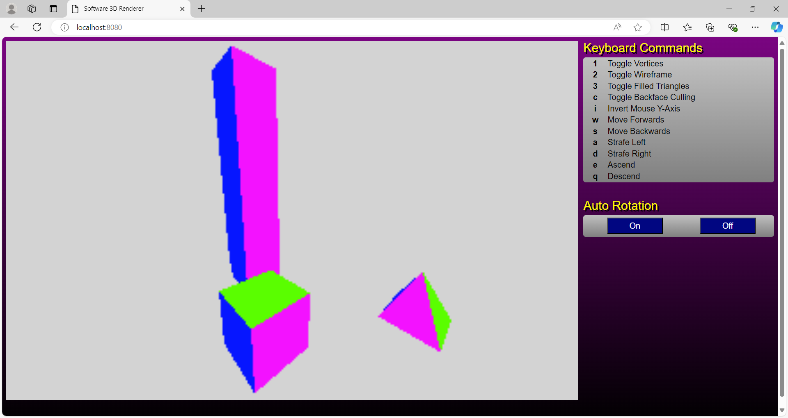
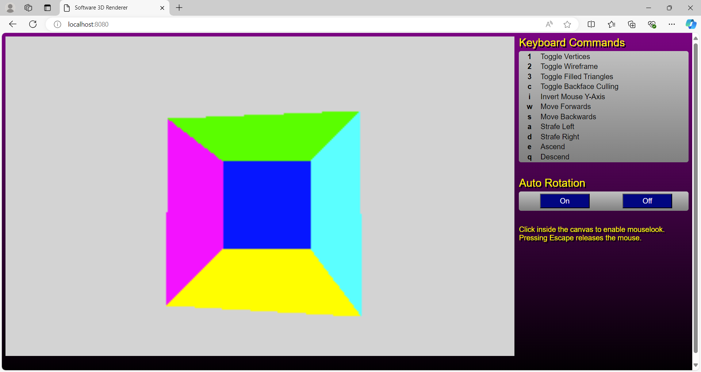
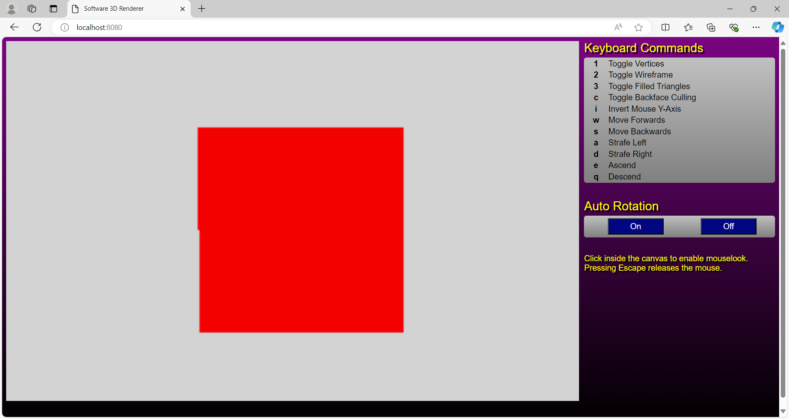
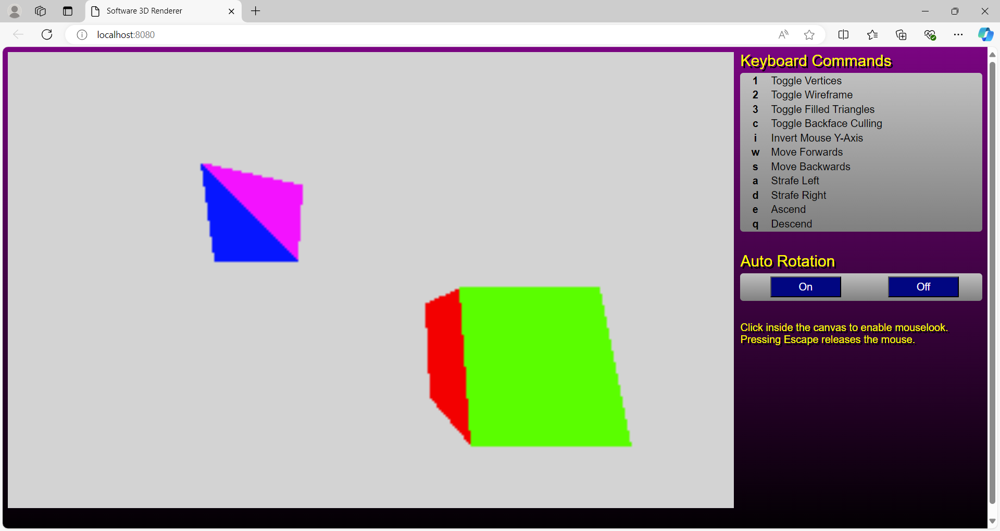
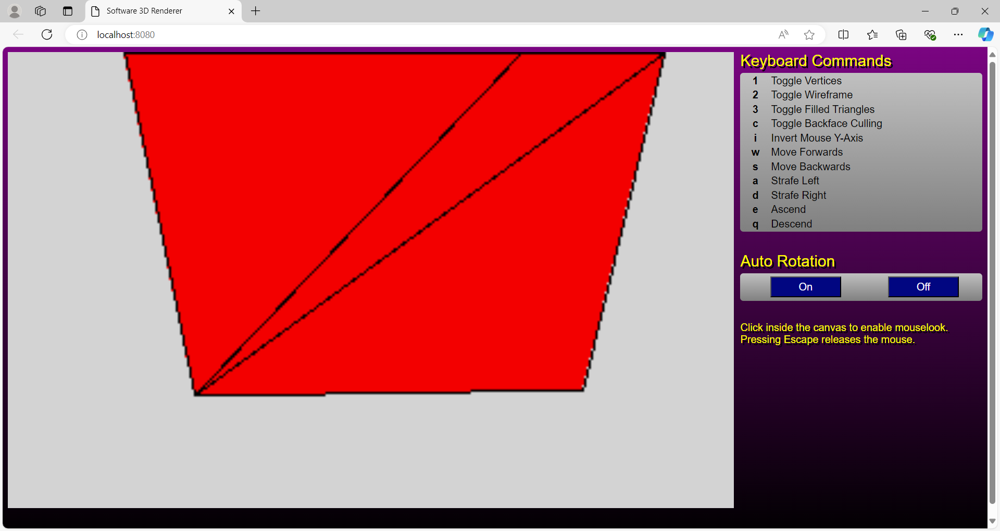

# **Massey 159.333 Capstone: 3D Software Renderer**

**Author: Tom White**

# Preface

This document covers the version of the web app originally submitted as part of my Computer Science Capstone project for Massey 159.333. Since then I have made some changes. These mainly involve refactoring, but also removing the MathJS library and writing my own linear algebra functions. As a result, some of the function calls shown in the code snippets have changed slightly. Using my own functions has both increased the rendering framerate and significantly reduced the filesize.

# Introduction

This project has been an investigation into learning the fundamentals of 3D graphics and real-time rendering, as used in rendering 3D video games, with the end goal of producing a web application allowing a user to navigate around a simple 3D scene. The rendering approach explored has been relatively low-level and old-fashioned, similar to techniques used before the popularisation of dedicated "3D Accelerator" GPUs or APIs such as DirectX or OpenGL. This was deliberate; I wanted to avoid use of graphics libraries offering a lot of ready-made functionality in order to try and learn more about what is happening "under the hood". I was also motivated by a curiosity in how 3D real-time rendering was approached historically using the relatively limited hardware available of the past. Finally, I was also looking to apply some of the linear algebra knowledge gained from a first-year introductory paper to an interesting project.

Prior to starting this project, I had little-to-no experience working on anything related to 3D graphics. I did have some previous experience in writing a simple 2D game in JavaScript that involved the use of HTML Canvas. To learn the subject, I followed a video course “3D Computer Graphics Programming” made available through an online learning platform called Pikuma. (Learn 3D Computer Graphics Programming from Scratch, n.d.) **Most of the code shown in this document is based on or otherwise copied from the material presented in that course, modified to work in TypeScript.** During the course I took notes and screenshots of material for reference, and followed the implementation of the renderer presented there using C and the multimedia library SDL. I then ported this code to TypeScript, modifying code where necessary to work with HTML Canvas. I feel porting the code served as a review of the topics covered in the course, as well as helping me gain proficiency in an unfamiliar language.

This report covers what I learned throughout the course, with code snippets shown from my TypeScript port. A live demo of this web app is deployed at <https://twwhite84.github.io>



*Figure 1 TypeScript web application version rendering with three meshes.*

# Project Setup

This project was originally developed in C using the multimedia library SDL by following the videos on the Pikuma website for the course mentioned above, before being modified to run with TypeScript using HTML Canvas and a math library called MathJS. Both versions have been packaged in the same Git repository, which was updated regularly throughout development. This repository is located here: <https://github.com/twwhite84/3d_software_renderer>

Setting up the C version was straightforward. I already have the tooling installed on my computer due to using C/C++ in other courses for my degree. The version of C I use – gcc 13.2.0 - is included as part of a software environment called MSYS2. This environment also includes a package manager, pacman. I installed SDL2 by following the instructions on the website for the package manager. (Base Package: mingw-w64-SDL2, n.d.) For a makefile I used the one provided with the course. I also set up the build and debug configurations inside of Visual Studio Code to make development easier; the instructions for this are on the Visual Studio Code documentation website. (Debug C++ in Visual Studio Code, n.d.)

When working on the TypeScript version, I originally set up a simple rendering loop using requestAnimationFrame and responding to keyboard input, referring to the website MDN for help. (Window: requestAnimationFrame() method, n.d.) had all code in a single source file and compiled by running the compiler tsc following the instructions on the TypeScript website. (TypeScript Tooling in 5 minutes, n.d.) However I wanted to have my source code spread across multiple files instead as it is easier to manage and closer to how the C version is arranged. In order to do this, I made use of a bundler called Webpack, which is able to take multiple TypeScript files and bundle them into a single Javascript file. This involved setting up a configuration file by following the relevant guides on the Webpack site, using a plugin to instruct the TypeScript compiler to produce sourcemaps in order to debug the web app in the browser from Visual Studio Code. (TypeScript \| webpack, n.d.) Webpack also made it easier to use MathJS, as it let me configure it to use tree-shaking so that only the functions I imported contributed to the final project size. (Custom bundling, n.d.). For the web page itself I quickly created a simple HTML page partioned into a canvas area and instructions using divs, then applied some simple CSS styling.

## Organisation

Both versions follow the same general loop structure:

```
While not done:
Get time delta
ProcessInput(time delta)
Update()
Render()
```

The **time delta** is the difference between timestamps taken at each loop iteration. This is multiplied by rates defining things like the speed of camera movement, rotation of meshes when set to rotate automatically, etc. Use of a time delta decouples the speed of the program from the framerate, so instead of the program slowing down as more rendering options are enabled, the framerate decreases. This technique is commonly used to regulate the speed in videogames. (Delta timing, n.d.)

**ProcessInput()** handles keyboard events that have been registered and are waiting to be processed. This is done with a Record data structure. When JavaScript event listeners detect a keydown or keyup event, the key being pressed is checked and the record updated. On each iteration, the record is checked and the events handled according to what that key has been assigned to do, such as updating properties on the Camera class. (Note: I have put the mouse input handling in its own separate function instead.)

**Update()** handles updates to the various matrices, applies transformations to vertices on each frame, performs culling, clipping and projection.

**Render()** handles the actual painting to the canvas once the vertices have been projected. Depending on the rendering mode selected, this will involve some combination of drawing vertices, wireframe or solid filled triangles.

## Files

The web app is portioned into a number of files covering different roles within the project:

-   **Main:** this defines the functions listed above. It holds a list of all meshes currently in the wold space; gets the user input; updates the view matrix; combines any other transformations of the meshes into a world matrix; applies all transformations to the triangles grouping the vertices; and renders the updated scene.
-   **Camera:** stores the state of the camera – position, direction, axis – and has a method *getTarget()* which returns a 3D vector used to update the view matrix.
-   **Clipping:** defines a clipping pipeline to handle when triangles go partially out-of-view of the camera’s view frustum, as well as polygon and plane data structures.
-   **Input:** defines event listeners and actions for keyboard and mouse, toggles rendering options and updates camera position using the time delta as a factor.
-   **Matrices:** contains methods to return various kinds of 4x4 matrices, including the transformations matrices (scale, rotate, translate) and projection matrices. These are multiplied with the vectors defining the vertices in the world space in order to move them about, prepare for 2D display (on the monitor), etc.
-   **Mesh:** defines a mesh interface, along with a few basic shapes: cube, prism and pyramid.
-   **Renderer:** stores the colour and z-buffers, and methods for drawing pixels, lines and triangle filling.
-   **Triangle:** this defines a data structure for containing points of triangles that have been converted to use homogenous coordinates. It also defines a method for computing barycentric weights, which are for performing per-pixel interpolation across a face surface.
-   **Vector:** contains functions for converting between vectors of differeing dimensions, along with associated type definitions.

## Rendering Pipeline

The app follows a rendering pipeline outlined in the course (Clipping Space, n.d.), which consists of the sequence of steps shown below:

1.  **Model Space:** for each mesh – cube, pyramid, prism – the vertices are fetched and processed as sets of triangles. Vertices and their mappings to faces are defined in the mesh file.
2.  **World Space:** each triangle is positioned in the world by multiplying its position vector (vertex) by a world matrix, which multiplies several transforms – rotation, scaling and translation – to combine them into one.
3.  **Camera Space:** the view matrix is updated to reflect the current orientation of the camera, and it enables the scene to be drawn relative to where the camera is positioned and where it is looking. This is applied to the position vectors in the same way as other transformations are.
4.  **Backface Culling:** this stage uses a linear algebra dot product to check the degree of alignment between a normal from a meshes’ face (with the front side of a face being determined by a clockwise ordering of vertices in a triangle, due to using a left-hand coordinate system)
5.  **Clipping:** uses the planes forming the boundaries of the current view frustum, and the normals to those planes. Uses the dot product between a triangle’s point and the plane-normal. If the dot product is 0, the point lies on the plane; if \> 0, within the plane, if \< 0, outside the plane.Looks at pairs of triangle points to see if one lies within and the other without the plane, in which case clipping is performed to create a quad or some other non-triangular polygon. Finally this is subdivided into triangles again.
6.  **Projection:** uses a projection matrix to transform a vector in 4D (homogenous coordinates, where the 3D vector x,y,z has been turned into x,y,z,1) in accordance with aspect ratio, field of view and z near/far limits. It then performs perspective division by dividing x,y,z by w. The end result is a vector we can simply take the x and y components from and map on a 2D coordinate system, e.g. the screen. The divided z is used to perform z-buffering, which checks individual pixel depths and repaints them in the event one mesh or triangle of a mesh is positioned in front of another.

# Implementing the Renderer

The renderer was implemented in multiple stages, with each stage generally being more complex than the previous. I have grouped some of them here, with the work performed at each stage described below.

## Rendering Vertices

In order to plot a vertex, or anything else, I first needed a way of painting pixels to the screen.

Both C and TypeScript versions make use of a **colour buffer**, which is a large array of numbers that holds RGBA values for one unit of screen space called a **pixel**. The number of pixels corresponds to the internal resolution of the HTML Canvas for the web app. I made a function **drawPixel(x, y, colour)** that takes the x and y coordinates of where the pixel is to be painted on screen and its colour. This function calculates an offset in the 1D array: offset = (y \* width + x) \* 4. The reason for the 4 is that HTMLCanvas stores the RGBA values as separate 8-bit numbers, so every 4 elements in the array represents the colour state of a pixel. (ImageData - Web APIs \| MDN, n.d.) The array is written to for every pixel that needs to be drawn.

```
// creating the colour buffer
Renderer.image_data = Renderer.context.getImageData(0, 0, Renderer.canvas.width, Renderer.canvas.height);
Renderer.pixel_buffer = Renderer.image_data.data;
// updating the colour buffer
drawPixel(x: number, y: number, colour: vec4_t) {
  const R = 0, G = 1, B = 2, A = 3;
  let offset: number = (y * Renderer.canvas.width + x) * 4;
  Renderer.pixel_buffer[offset + 0] = colour[R];
  Renderer.pixel_buffer[offset + 1] = colour[G];
  Renderer.pixel_buffer[offset + 2] = colour[B];
  Renderer.pixel_buffer[offset + 3] = colour[A];
}
// displaying the colour buffer
Renderer.context.putImageData(Renderer.image_data, 0, 0);
```

I wrote a wrapper function **refresh()**; this function is called every frame, and wraps the HTML Canvas putImageData() function, which refreshes the canvas display with the current state of the colour buffer. I also created a **drawVertex(x, y, s, colour)** function; this simply calls drawPixel() repeatedly in order to paint enough pixels to form a square, as individual pixels are too small to properly see.

In order to use the drawVertex() function to show the vertices of a simple cube to screen, I needed a way of defining a vector position in 3D and a way of storing a collection of them representing a cube. This was achieved by creating a type alias for a length-3 array called **vec3_t**, and another array **vertices** inside a class to contain the vec3_t’s as subarrays.

```
// vertices for a cube
vertices: vec3_t[] = [
  [-1.0, -1.0, 1.0], //0
  [1.0, -1.0, 1.0],  //1
  [-1.0, 1.0, 1.0],  //2
  [1.0, 1.0, 1.0],   //3
  [-1.0, 1.0, -1.0], //4
  [1.0, 1.0, -1.0],  //5
  [-1.0, -1.0, -1.0],//6
  [1.0, -1.0, -1.0]  //7
]
```

To convert the 3D vertices of the mesh into 2D coordinates for display on the screen, a **projection matrix** is used. This involves the following steps:

1.  Transforming a 3D vertex from the model with components [x,y,z] into 4D homogeneous coordinates: [x,y,z,1].
2.  Applying a projection matrix to the now-4D coordinates using multiplication; this new vector has components [x,y,z,w].
3.  Performing perspective division on the resulting 4D vector. This involves dividing x, y and z by the w component.
4.  Taking the x and y components of the projected vector and plotting a vertex at those coordinates on the screen.

To do this, types **vec2_t** and **vec4_t** were made, similar to the vec3_t type. The projection matrix is created from a nested array that is passed into a MathJS matrix constructor and populated with values calculated from field of view, aspect ratio and draw distance parameters:

```
make_perspective(fov: number, aspect: number, znear: number, zfar: number): math.Matrix {
  let r0c0 = aspect * (1 / Math.tan(fov / 2));
  let r1c1 = 1 / Math.tan(fov / 2);
  let r2c2 = zfar * (zfar - znear);
  let r2c3 = (-zfar * znear) / (zfar - znear);
  return mathHelper.matrix([
    [r0c0, 0, 0, 0],
    [0, r1c1, 0, 0],
    [0, 0, r2c2, r2c3],
    [0, 0, 1.0, 0]
  ]);
}
```

The vertex is then multipled by the returned matrix, before having its [x,y,z] components divided by w. Finally, the x and y coordinates are passed to the drawVertex() function.


*Figure 2 Projected mesh vertices for a cube with effects of perspective division visible.*

## Transforming Vertices

In order to get a mesh moving on the screen in some way, transformation matrices are created and multiplied by vertices in a similar way as with the projection matrix. These transformation matrices are stored in the Matrices file and include matrices for scaling, translating and rotation. They are multiplied together into a “world” matrix, which is then multipled with the vertex to transform. This occurs before the projection, with both being inside the update function. The numbers providing measurements of how a transform should be applied are stored in the mesh structure itself, e.g. when scaling a mesh the numbers are updated on the scale property of that mesh and then fed to the matrix producing functions:

```
// transformation process, slightly simplified from code
meshes.forEach(mesh => {
// make transform matrices and combine into world matrix
scale_matrix = make_scaler(mesh.scale[X], mesh.scale[Y], mesh.scale[Z]);
translation_matrix = make_translator
(mesh.translation[X], mesh.translation[Y], mesh.translation[Z]);
rotation_matrix_x = make_rotator_x(mesh.rotation[X]);
rotation_matrix_y = make_rotator_y(mesh.rotation[Y]);
rotation_matrix_z = make_rotator_z(mesh.rotation[Z]);
world_matrix = mathHelper.identity(4) as math.Matrix;
world_matrix = mathHelper.multiply(world_matrix, scale_matrix);
world_matrix = mathHelper.multiply(rotation_matrix_z, world_matrix);
world_matrix = mathHelper.multiply(rotation_matrix_y, world_matrix);
world_matrix = mathHelper.multiply(rotation_matrix_x, world_matrix);
world_matrix = mathHelper.multiply(translation_matrix, world_matrix);
// later when looping through vertices…
transformed_vertex = mathHelper.multiply(world_matrix, vertex);
}
```

## Rendering a Wireframe

To render a wireframe, I needed to create a line drawing function. The algorithm implemented for the line drawing function is known as DDA (Digital Differential Analyzer):

```
drawLine(x0, y0, x1, y1, colour) {
  delta_x = (x1 - x0);
  delta_y = (y1 - y0);
  longest_side_length = abs(delta_x) >= abs(delta_y)) ? abs(delta_x) : abs(delta_y);
  x_inc = delta_x / longest_side_length;
  y_inc = delta_y / longest_side_length;
  current_x = x0;
  current_y = y0;
  for (let i = 0; i <= longest_side_length; i++) {
    Renderer.drawPixel(Math.round(current_x), Math.round(current_y), colour);
    current_x += x_inc;
    current_y += y_inc;
  }
}
```

I also needed a way of grouping the vertices so that they correspond to surfaces of the mesh. For example, a cube has 6 surfaces, so for the vertices in the mesh to represent those surfaces they need to be grouped in some way that corresponds to sides of the cube. For this project, triangles were used, resulting in 12 triangles for the cube, 2 per side. These groupings were stored in the mesh alongside the vertices. A loop was added so that vertices were transformed per triangle, packaged into a data type **triangle_t** containing the transformed vertices, pushed to a triangles array, and this array looped through with the line drawing algorithm.


*Figure 3 Vertices arranged into triangles and rendered in wireframe.*

## Backface Culling

Hiding the triangles of the mesh that are angled out of view requires two things: a way of determining which side of a triangle represents its exterior to the mesh, and comparing an normal vector from that side against a ray from the camera.

Determining the exterior side involves creating two vectors from vector subtraction of the triangle’s points: B-A and C-A. This is done in a clockwise orientation since this project is using a left-hand coordinate system. The vectors are then normalised. To determine whether the face is angled out of view of the camera, I took the cross-product of the two new vectors. This becomes the normal vector pointing away from the face. Finally, the dot product is taken between the normal and the vector representing the direction of the camera; if the dot product falls below 0, the loop is short-circuited and that face isn’t processed.

The above steps were all implemented in a function **shouldCull():**

```
// backface culling function, simplified
function shouldCull(vertices: vec4_t[]): boolean {
let a: vec3_t = Vector.vec4_to_vec3(vertices[0]);
let b: vec3_t = Vector.vec4_to_vec3(vertices[1]);
let c: vec3_t = Vector.vec4_to_vec3(vertices[2]);
let ab: vec3_t = mathHelper.subtract(b, a);
let ac: vec3_t = mathHelper.subtract(c, a);
ab = mathHelper.divide(ab, mathHelper.norm(ab)).valueOf() as vec3_t;
ac = mathHelper.divide(ac, mathHelper.norm(ac)).valueOf() as vec3_t;
let normal: vec3_t = mathHelper.cross(ab, ac).valueOf() as vec3_t;
normal = mathHelper.divide(normal, mathHelper.norm(normal));
// … jumping ahead a bit …
let dot_normal_camera: number = mathHelper.dot(normal, camera_ray);
if (dot_normal_camera < 0) { return true; }
return false;
}
```


*Figure 4 The mesh viewed at an angle with backface culling applied, hiding the triangles angled out-of-view.*

## Filled Triangles

To paint the triangles with a solid colour, I added a value to the mesh structure that references an enum value that maps more easily understandable labels like RED or BLUE to their RGBA hex codes.

I added a function **fillTriangle(triangle: triangle_t)** that implements a flat-bottom/flat-top triangle rendering algorithm. This algorithm splits the triangle to be filled into two smaller subtriangles with a flat and bottom respectively. One reason for doing this is that it makes it easier to fill the triangle row-by-row, as no matter how the parent triangle has been rotated or oriented, it can be split into two smaller triangles where the filling algorithm only needs to deal with two slopes per subtriangle to fill between.

The first step to the filling algorithm is to sort the triangle vertices in order of their y-values. Then another vertex is added at the same height as the middle y vertex. This becomes the flat bottom / flat top. The slopes are then calculated for each subtriangle, and they are filled row-by-row between x start and end coordinates which are updated on each row.

This by itself works well enough for the cube when the backface culling is enabled. However, once the culling is disabled, a problem becomes evident. Because depth information isn’t being taken into account when filling the triangle, there is no way to differentiate a foreground for a background element. To solve this problem, I initially implemented a “painter’s algorithm” function that calculates the mean Z value for each vertex in a triangle, sorts the faces accordingly and paints from back to front. However this was later replaced by a Z-buffer, which takes depth into account on a per-pixel rather than per-face basis.



*Figure 5 Rendering solid-filled triangles without taking depth into account. The face closest to the camera has been completely painted over by background elements.*

## Z-Buffering

To solve the problem of rendering mesh faces in the wrong order, I needed to add a way of differentiating background from foreground elements. This was done by adding another array similar to the colour buffer, but for pixel z-values instead of colours. Whenever a pixel is drawn at some coordinate, a comparison of that pixel’s z value is made against the last pixel drawn at the same coordinates. If the newer pixel is closer to the camera than the old, that coordinate is painted over.

To find the z value associated with a pixel, I use a form of interpolation called Barycentric weights. Whenever a triangle is being filled, each pixel in the triangle is visited. The coordinates of each pixel being visited are passed with the containing triangle’s vertex coordinates to the **Triangle.findWeights()** method. This function returns a set of factors [alpha, beta, gamma] that can be thought of as a relative coordinate system rather than absolute. For example, instead of a coordinate [100,100,100], it might return [0.3, 0.3, 0.4]. Each weight tells you the degree that the passed point is “pulled” towards each vertex of the triangle. Finally, to find the depth associated with the pixel, I divide each weight returned by the corresponding vertices W component, sum and subtract from 1. If the depth is closer to the camera than the entry for the associated pixel currently in the z-buffer, the pixel is repainted.

```
// paint pixel if closer to camera than last pixel at that location
let interp_recp_w: number = 1 - (
(alpha/a[VectorIndex.W])+(beta/b[VectorIndex.W])+(gamma/c[VectorIndex.W])
);
if (interp_recp_w < Renderer.getZBufferAt(x, y)) {
  Renderer.drawPixel(x, y, triangle.colour);
  Renderer.setZBufferAt(x, y, interp_recp_w);
}
```



*Figure 6 With Z-buffering implemented, the faces are renderered in the correct order.*

## Camera

To implement a camera, a class was created with properties for position, yaw and pitch, and a method **getTarget()** for returning the current target (direction) vector. This target vector is the sum of the current camera position and the z unit vector after it has been transformed by the current camera properties.

The target vector returned is then used to create a view matrix by calling Matrices.make_view() with the target, as well as the camera position and a y vector. The reason for the target and y vectors are so that a cross-product can be computer to get the third axis and form a new set of axes. This is then used to transform the vertices to be rendered at the same as any other transformations, e.g. scaling and rotation.

Finally, to update the view in response to user input, event handlers were added to the Input class updating the position, yaw and pitch properties in response to keyboard and mouse changes. These functions use multiply the difference in seconds between timestamps computed on each iteration of the main loop by a movement rate:

```
// mouse movement
document.addEventListener('mousemove', (event) => {
  if (document.pointerLockElement === Renderer.canvas) {
    Input.handleMouseEvent(event, ts_delta);
  }
});
// ...
handleMouseEvent(event: MouseEvent, ts_delta: number) {
  let y_clamp: number = (89 * Math.PI) / 180;
  Camera.yaw += event.movementX * 0.1 * ts_delta;
  Camera.pitch += event.movementY * 0.1 * ts_delta * Input.yflip;
  if (Camera.pitch > y_clamp) Camera.pitch = y_clamp;
  if (Camera.pitch < -y_clamp) Camera.pitch = -y_clamp;
}
```



*Figure 7 Viewing meshes from above is achieved by transforming the scene with a view matrix.*

## Clipping

Without clipping, the renderer can’t handle situations where a mesh begins to go out of view of the camera. This happens whenever a triangle’s vertices start to cross outside any of the 6 frustum planes enclosing the viewable area in front of the camera

When a triangle from a mesh goes partly out of this frustum, it needs to be trimmed or “clipped”. This means that a triangle can end up becoming a quadrilateral or some other polygon as the portion of the triangle that crosses a frustum plane gets cut off. The portion that remains within the viewing frustum is then subdivided into new triangles for rendering.

To perform this task, a triangle type is first converted to a polygon type that can hold more than three vertices. The polygon is then passed into a function **clipPolygon()** that feeds a clipping pipeline and returns a polygon that may have more than 3 vertices, depending on whether any clipping needed to be performed. This polygon is then passed into **trianglesFromPolygon()** which subdivides the polygon and returns an array of triangles.

The clipping pipeline calls **clipPolygonAgainstPlane()** on the polygon repeatedly, once for each of the clipping planes. This function examines the vertices of the polygon in pairs and compares each against the normal from the plane using a dot product. If one point is within the frustum wall while the other lies outside, which occurs when the signs of the dot product differ, then the intersection is found using interpolation. This interpolated point replaces the point outside the frustum in a list defining the clipped polygon.

The below code is the core of clipPolygonAgainstPlane(). Lerp refers to the linear interpolation function. Q1 and Q2 are the vertex pair currently being examined.

```
// if vertex pair is inside-outside, find intersection
if ((current_dot * previous_dot) < 0) {
  // find the interpolation factor t: dotQ1 / (dotQ1 - dotQ2)
  let t: number = previous_dot / (previous_dot - current_dot);
  // calculate intersection point I = Q1 + t(Q2-Q1)
  let intersection_point: vec3_t = [
    Clipping.lerp(previous_vertex[VectorIndex.X],
    current_vertex[VectorIndex.X], t),
    Clipping.lerp(previous_vertex[VectorIndex.Y],
    current_vertex[VectorIndex.Y], t),
    Clipping.lerp(previous_vertex[VectorIndex.Z],
    current_vertex[VectorIndex.Z], t)
  ];
  // insert intersection point into list of "inside vertices"
  inside_vertices[num_inside_vertices] = intersection_point;
  num_inside_vertices++;
}
// current vertex is within the current frustum plane
if (current_dot > 0) {
  inside_vertices[num_inside_vertices] = current_vertex;
  num_inside_vertices++;
}
```



*Figure 8 The effect of the clipping function is seen by the creation of a third triangle for a cube partially out-of-view.*

## Multiple Meshes

In order to display multiple meshes on screen at once, I needed to refactor my mesh file slightly. Originally I just had a cube class with static properties and methods. I changed this by creating a mesh interface and making instantiable meshes with a couple of new shapes: pyramid and prism. Then I wrapped the loop iterating through the faces of a mesh in an outer loop iterating through several meshes stored in an array.


*Figure 9 Rendering muliple meshes, with background meshes correctly obscured and clipped.*

# Conclusion

I have found learning about the basics of 3D real-time graphics rasterisation to be fulfilling and it has satisified a lot of curiosity I have had about the topic.

A challenge I faced in porting the code over as a web application was in the use of MathJS. This is a library that may be better suited for situations where precision is more important than speed, as originally my web app rendered very choppily. I managed to isolate the problem to the barycentric weights calculation and found a large increase in framerate occurred when rewriting the division to use native JavaScript/TypeScript division rather than the division function provided with MathJS.

I decided to skip implementing the texture mapping and lighting from the C version shown on Pikuma in order to save time. My main focus was in presenting a navigable 3D scene with multiple meshes. I will probably redo this project from scratch in my own time at some point with the texture mapping and lighting implemented, as well as deal with some visual glitches where triangles disappear, rendering speed dropping when up close to a mesh, or unwanted pixels being drawn on the side of the screen during clipping. I would probably also implement the linear algebra functions myself rather than rely on MathJS. However I am satisfied with the results for a first attempt at a simple 3D renderer.

# References

*Base Package: mingw-w64-SDL2*. (n.d.). Retrieved from MSYS2: https://packages.msys2.org/base/mingw-w64-SDL2

*Clipping Space*. (n.d.). Retrieved from Pikuma: https://courses.pikuma.com/courses/take/learn-computer-graphics-programming/lessons/28782726-clipping-space

*Custom bundling*. (n.d.). Retrieved from math.js \| an extensive math library for JavaScript and node.js: https://mathjs.org/docs/custom_bundling.html

*Debug C++ in Visual Studio Code*. (n.d.). Retrieved from Visual Studio Code: https://code.visualstudio.com/docs/cpp/cpp-debug

*Delta timing*. (n.d.). Retrieved from Wikipedia: https://en.wikipedia.org/wiki/Delta_timing

*ImageData - Web APIs \| MDN*. (n.d.). Retrieved from MDN: https://developer.mozilla.org/en-US/docs/Web/API/ImageData

*Learn 3D Computer Graphics Programming from Scratch*. (n.d.). Retrieved from Pikuma: https://pikuma.com/courses/learn-3d-computer-graphics-programming

*Package: mingw-w64-ucrt-x86_64-SDL2*. (2024, 10 24). Retrieved from MSYS2 Packages: https://packages.msys2.org/packages/mingw-w64-ucrt-x86_64-SDL2

*TypeScript \| webpack*. (n.d.). Retrieved from webpack: https://webpack.js.org/guides/typescript/\#source-maps

*TypeScript Tooling in 5 minutes*. (n.d.). Retrieved from TypeScript: https://www.typescriptlang.org/docs/handbook/typescript-tooling-in-5-minutes.html

*Window: requestAnimationFrame() method*. (n.d.). Retrieved from mdn web docs: https://developer.mozilla.org/en-US/docs/Web/API/Window/requestAnimationFrame
